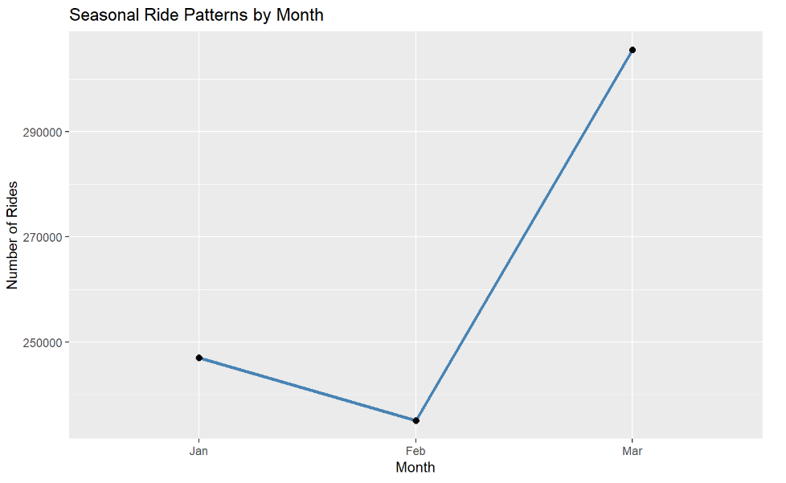
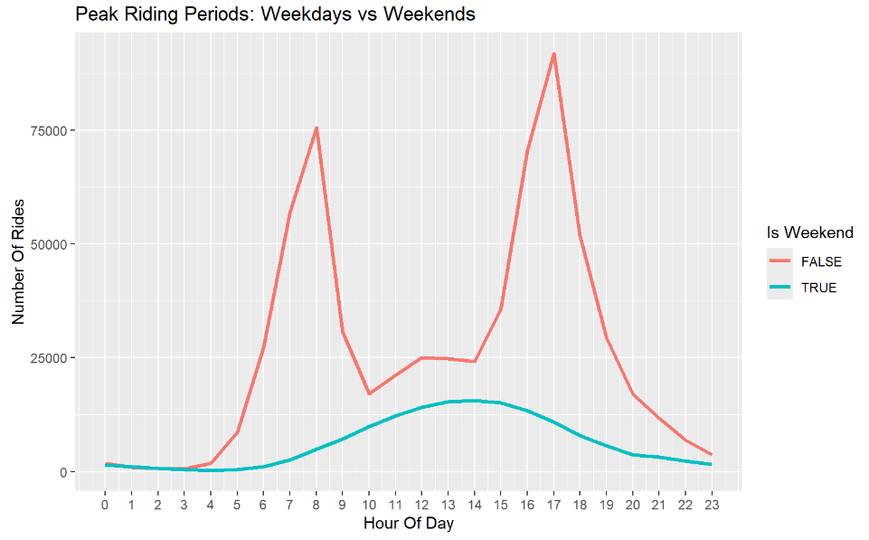
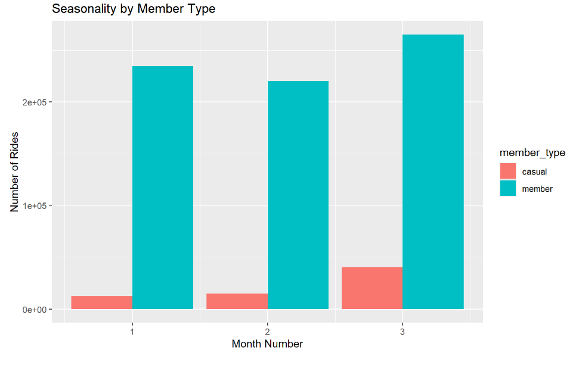

# Cyclistic Bike-Share Case Study  
### A Data Analysis Project Using R, Kaggle, and Posit Cloud

This project analyzes bike-share usage patterns to understand how casual riders and annual members use Cyclistic differently. The goal is to uncover behavioral trends, identify opportunities to increase annual memberships, and provide data-driven recommendations to support Cyclistic’s marketing strategy.

---

## Project Summary

Using real trip data from the Cyclistic bike-share program, I performed a full end-to-end analysis, including:

- Cleaning and merging data from multiple years  
- Engineering time-based features (season, hour, weekday/weekend, etc.)  
- Identifying trends in ride length, peak hours, and user behavior  
- Creating visualizations to compare casual riders vs. annual members  
- Generating insights to help marketing teams improve rider conversion  

This project strengthens skills in **R programming**, **data wrangling**, **EDA**, and **visual storytelling**.

---

## Tools & Technologies Used

- **R (tidyverse, lubridate, ggplot2, janitor)**  
- **R Markdown** for narrative reporting  
- **Kaggle Notebooks** for shared, reproducible analysis  
- **Posit Cloud** for development environment  
- **GitHub** for project hosting and version control  

---

## Repository Structure

```
cyclistic-bike-share-analysis/
├── README.md                 <- Overview of the project (this file)
├── cyclistic_analysis.Rmd    <- Full narrative + code
├── cyclistic_analysis.html   <- Rendered HTML report 
├── final_report.docx         <- Written project report
```

 **Note:** The official Divvy/Cyclistic datasets cannot be uploaded due to license restrictions.  
Instead, a link to the original data source or Kaggle notebook is provided below.

https://www.kaggle.com/datasets/vaishalichawla01/cyclistic-bike-share-2019q1-2020q1

---

## Key Findings (Summary)

- **Casual riders take longer rides** than members, often 3× longer.  
- **Members ride more consistently** across weekdays, showing commuter behavior.  
- **Weekends show a large spike** in casual usage, indicating leisure patterns.  
- Peak hours differ by user type — members ride during commute times; casual riders during afternoons.  

---

## Visualizations

This project includes charts for:

- Hourly ride distribution  
- Weekday vs. weekend behavior  
- Ride duration comparison  
- Seasonal ride patterns  
- Member vs. casual usage by month  


```






```

---

## Links

### Kaggle Notebook  
My interactive analysis is available here:   
`[https://www.kaggle.com/your-notebook-link](https://www.kaggle.com/code/vaishalichawla01/cyclistic-bike-share-capstone-project)`

### Full Written Report  
[Project Report](https://github.com/Vaishalichawla1/Cyclistic-Bike-Share-Analysis/blob/main/CYCLISTIC%20BIKE-SHARE%20CASE%20STUDY.pdf) 

### Original Data Source  
[Divvy Data License](https://divvybikes.com/data-license-agreement)

[Public Dataset](https://www.kaggle.com/datasets/vaishalichawla01/cyclistic-bike-share-2019q1-2020q1)  

---

## How to Reproduce the Analysis

1. Clone the repository  
2. Open the `cyclistic_analysis.Rmd` file  
3. Ensure required R packages are installed:  
   ```r
   install.packages(c("tidyverse", "ggplot2"))
   ```
4. Knit the Rmd to generate the full HTML report.

---

## About This Project

This case study was completed as part of the **Google Data Analytics Certificate**.  
It demonstrates practical data analysis skills, including:

- Data cleaning  
- Exploratory data analysis  
- Visualization  
- Insight generation  
- Storytelling with data  

---
